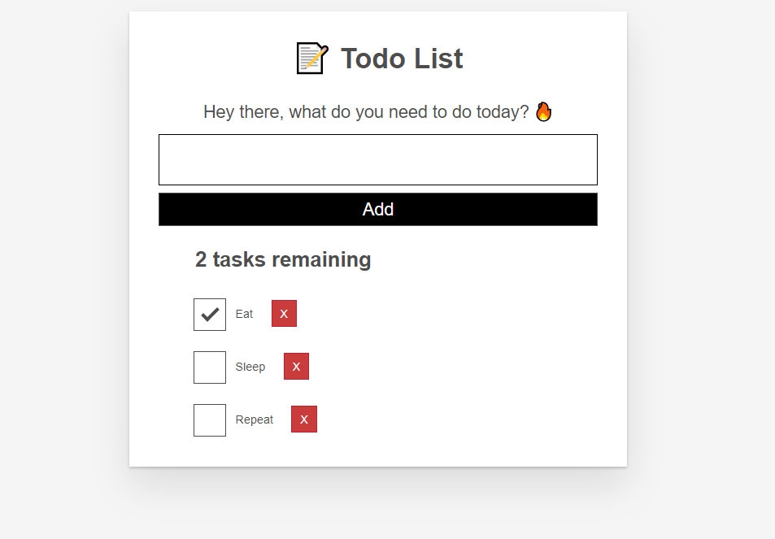

## Overview

In this exercise, we aim to create a basic to-do list app using ReactJS. 

Initially, I was trying to avoid making a to-do list because everyone seems to make it as one of the first projects to do when they are starting out with any programming language. 

To my surprise, I learned a couple of tricks like **CallBack Props** and **Accessibility Features** while following the MDN React ToDo List App Tutorial. 

*Disclaimer:* Most of this is inspired from the tutorial; however, I downsized this project and opted to remove the `EDIT` functionality, as it requires ton more UI workarounds (and code!) to do. Moreover, it feels like it does not add to my learning objectives that much. Besides, most beginner to-do list apps only have add and remove task features anyway.

## Our Apps' User Stories

As a user, I can:
- Read a list of tasks
- Add a task using the mouse or keyboard
- Mark any task as completed
- Delete any task

## Creating the Basic App Structure

I added the following chunks of code to the `App.js` file that corresponds to different `components` of the application. I will separate them later into different components later on.

### 1. ToDo List Form
```jsx 
    <form>
    <h2 className="label-wrapper">
        <label htmlFor="new-todo-input" className="label__lg">
        Hey there, what do you need to do today? 🔥
        </label>
    </h2>
    <input 
        type="text"
        id="new-todo-input"
        className="input input__lg"
        name="text"
        autoComplete="off"
        />
        <button type="submit" className="btn btn__primary btn__lg">
        Add
        </button>
    </form>
```


### 2. List Counter
```jsx
    <h2 id = "list-heading">
    3 tasks remaining
    </h2>
```

### 3. ToDo List Items
```jsx
    <ul 
    role="list"
    className="todo-list stack-large stack-exception"
    aria-labelledby="list-heading"
    >
    <li className="todo stack-small">
        <div className="c-cb">
        <input id="todo-0" type="checkbox" defaultChecked={true}/>
        <label className="todo-label" htmlFor="todo-0">
            Eat
        </label>

        <button
            type="button"
            className="btn btn__danger"
            style={{"margin-left": 10}}
        > X <span className="visually-hidden"> Eat </span>
        </div>
    </li>
    </ul>
```

## Styling the App
After styling, the app should look like this:
<div className="Image__Small">
  
</div>


## Finishing up the React Components
Then, I worked on making each part of the code as React Components:

### 1. Todo.JS
```jsx
    import React from "react";

    export default function Todo(props) {
        return (
        <li className="todo stack-small">
            <div className="c-cb">
                <input
                    id={props.id}                                                                                                                                               
                    type="checkbox"
                    defaultChecked={props.completed}
                    onChange={() => props.toggleTaskCompleted(props.id)}
                />

                <label className="todo-label" htmlFor="todo-0">
                    {props.name}
                </label>
                <button
                    type="button"
                    className="btn btn__danger"
                    onClick={() => props.deleteTask(props.id)}
                    style={{"margin-left": 10}}
                    > X 
                <span className="visually-hidden">{props.name}</span>
                </button>
            </div>                                                               
        </li>
        );
    }
```

### 2. Form.js
```jsx
    import React, {useState} from "react"

    const Form = (props) => {

        const [name, setName] = useState('')

        function handleSubmit(e) {
            e.preventDefault();
            props.addTask(name)
            setName("");
        }
        
        function handleChange(e){
            setName(e.target.value);
        }

        return(
            <form onSubmit={handleSubmit}>
            <h2 className="label-wrapper">
            <label htmlFor="new-todo-input" className="label__lg">
                Hey there, what do you need to do today? 🔥
            </label>
            </h2>
            <input 
                type="text"
                id="new-todo-input"
                className="input input__lg"
                name="text"
                autoComplete="off"
                value = {name}
                onChange={handleChange}
            />
            <button type="submit" className="btn btn__primary btn__lg">
            Add
            </button>
        </form>
        )
    }

    export default Form;
```

The final `App.js` file is shown below:
```jsx
import './App.css';
import Todo from './components/Todo';
import Form from './components/Form';
import React, {useState} from "react";
import {nanoid} from "nanoid";


function App(props) {
  const [tasks, setTasks] = useState(props.tasks);

  const taskList = tasks.map(task => (
    <Todo
      id={task.id}
      name={task.name}
      completed={task.completed}
      key={task.id}
      toggleTaskCompleted={toggleTaskCompleted}
      deleteTask={deleteTask}
    />
  ));

  const addTask = (name) => {
    const newTask = { id: "todo-" + nanoid(), name: name, completed: false };
    setTasks([...tasks, newTask]);
  }

  function deleteTask(id) {
    const remainingTasks = tasks.filter(task => id !== task.id);
    setTasks(remainingTasks);
  }

  function toggleTaskCompleted(id) {
    const updatedTasks = tasks.map(task => {
      // if this task has the same ID as the edited task
      if (id === task.id) {
        // use object spread to make a new object
        // whose `completed` prop has been inverted
        return {...task, completed: !task.completed}
      }
      return task;
    });
    setTasks(updatedTasks);
  }
    // FILTERING AND COUNTING REMAINING TASKS
    const remainingTasks = tasks.filter(task => task.completed==false);
    const tasksNoun = remainingTasks.length!== 1 ? 'tasks' : 'task';
    const headingText = `${remainingTasks.length} ${tasksNoun} remaining`;

  return (
    <div className="todoapp stack-large">
      <h1>📝 Todo List </h1>
      <Form addTask={addTask}/>

      <h2 id = "list-heading">
        {headingText}
      </h2> 

      <br>
      </br>

      <ul 
        role="list"
        className="todo-list stack-large stack-exception"
        aria-labelledby="list-heading"
      >
        {taskList}

      </ul>
    </div>
  );
}

export default App;
```

## Check it out:
- [React ToDo List App](http://react-todo-list.decoroustea.xyz/)
- [Github Link](https://github.com/tristanjoshuaalba/react-todo-list)

## Useful references:
[React Todo List - Mozilla Developer Network](https://developer.mozilla.org/en-US/docs/Learn/Tools_and_testing/Client-side_JavaScript_frameworks/React_todo_list_beginning)